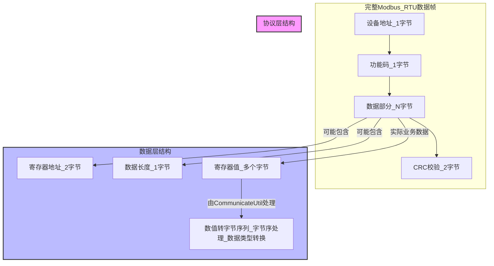
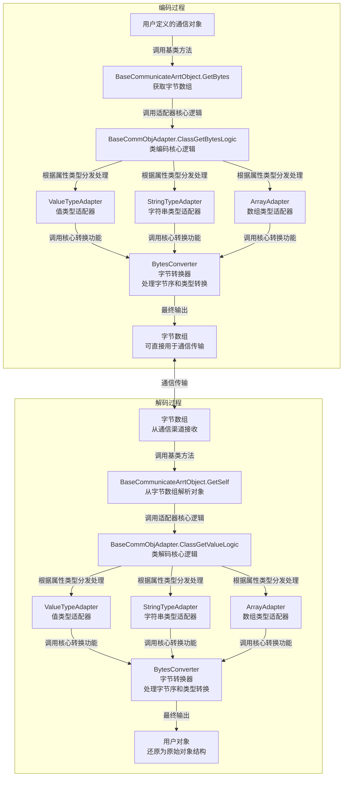

# CommunicateUtil - 字节流通信编码解码工具库

一个致力于让字节流通信协议数据层编码解码变得更简单的C#工具库。

**开源地址：** https://gitee.com/zgf211998110/communicate-util.git
**AI项目解读：** https://deepwiki.com/zgfdada/communicate-util

## 项目概述

CommunicateUtil 是一个基于反射实现的高效、灵活的C#工具库，专为简化各种字节流通信协议中的数据编码和解码工作而设计。它专注于数据层的编解码处理，不关注协议层的具体实现细节。通过该工具库，能够将C#对象与字节数组进行相互转换，支持多种数据类型和字节序，极大地简化了通信协议的实现过程。

### 协议层与数据层的区别案例

以Modbus RTU协议的数据帧结构为例，我们可以清晰地看到协议层和数据层的具体划分：

#### Modbus RTU数据帧结构 - 协议层与数据层划分



#### 数据层详解

数据层主要处理实际业务数据的编码和解码，在Modbus RTU中，数据层包括：

**数据层的工作内容：**
- 将数值（如温度值、压力值等）转换为对应的字节表示
- 处理字节序（Modbus RTU使用大端字节序）
- 字符串与字节序列的相互转换
- 数组和复杂数据结构的序列化与反序列化

这正是CommunicateUtil库所关注和解决的核心问题。

#### 协议层详解

协议层定义了通信的规则和框架，在Modbus RTU中，协议层包括：

**协议层的工作内容：**
- 定义数据包格式（设备地址、功能码、CRC校验等）
- 实现Modbus功能码（如读保持寄存器0x03、写单个寄存器0x06等）
- 处理通信异常（超时重传、CRC校验错误等）
- 管理通信的状态和会话

CommunicateUtil不涉及这些协议层的实现，它只负责数据本身的编码和解码。

## 主要功能

- **数据类型转换**：支持基本值类型、枚举、字符串、数组、集合与字节数组之间的相互转换
- **字节序控制**：支持四种字节序格式（小端模式Little_DCBA、大端模式Big_ABCD、交换小端LittleSwap_CDAB、交换大端BigSwap_BADC），可灵活配置每个字段的字节序，适应不同通信协议的要求
- **自定义通信对象**：通过特性标记方式，轻松定义和解析复杂的通信协议结构
- **灵活的索引配置**：支持自定义字段顺序、起始索引等
- **嵌套对象支持**：支持通信对象的嵌套定义和解析
- **数据验证**：提供属性级别的数据验证功能

### 数据流向图



- **数据类型转换**：支持基本值类型、枚举、字符串、数组、集合与字节数组之间的相互转换
- **字节序控制**：支持小端模式、大端模式等多种字节序格式
- **自定义通信对象**：通过特性标记方式，轻松定义和解析复杂的通信协议结构
- **灵活的索引配置**：支持自定义字段顺序、起始索引等
- **嵌套对象支持**：支持通信对象的嵌套定义和解析
- **数据验证**：提供属性级别的数据验证功能

## 项目结构

项目采用了模块化的设计，将不同类型的数据处理逻辑分离到不同的适配器中，同时提供了统一的接口和基础功能。

```
├── CommunicateUtil\
│   ├── BytesConverter.cs          # 核心字节转换工具类
│   ├── CommunicateArrtibute.cs    # 通信特性类和相关工具
│   ├── ReflectionEx.cs            # 反射扩展工具类
│   ├── BytesDataAdapters\         # 各种数据适配器
│   │   ├── ValueTypeAdapters\     # 值类型适配器
│   │   ├── StringTypeAdapters\    # 字符串类型适配器
│   │   ├── ArrayValueTypeAdapters\ # 数组类型适配器
│   │   └── BaseCommObjAdapters\   # 通信对象适配器
│   └── UiViewAdapter\             # UI视图适配器
├── TestProject1\                  # 测试项目
│   ├── _0_ValueTest.cs            # 基本数据类型测试
│   ├── _1_ValueArrayTest.cs       # 数组类型测试
│   ├── _2_ValueListTest.cs        # 列表类型测试
│   ├── _3_CommArrObjTest.cs       # 通信对象测试
│   ├── _4_CommArrObjTest.cs       # 高级通信对象测试1
│   └── _5_CommArrObjTest.cs       # 高级通信对象测试2
```

## 核心类介绍

### BytesConverter

`BytesConverter` 是整个库的核心类，提供了值类型与字节数组之间的转换功能，支持不同的字节序配置。

**主要方法**：
- `ValueToBytes<T>(T value, EndianType endianType)`：将值类型转换为字节数组
- `BytesToValue<T>(byte[] bytes, EndianType endianType)`：将字节数组转换为值类型
- `GetBytes<T>(T value, EndianType endianType, int strLengh = 11)`：将各种类型的数据转换为字节数组

### CommunicateArrtibute

`CommunicateArrtibute` 是一个特性类，用于标记和配置需要参与编码解码的属性。

**主要属性**：
- `OrderIndex`：控制属性在协议字节流中的排序顺序，数值越小越先处理，默认值为0
- `StartIndex`：指定属性在字节流中的起始索引位置，用于处理非连续的协议结构，默认值为-1（自动计算）
- `ArrayLength`：设置数组或集合的长度（适用于长度信息与内容不连续的情况），可指定固定数字或其他属性名
- `AutoLengthType`：设置自动长度类型（适用于长度信息与内容连续的情况），直接在字节流中添加长度信息
- `EnumEndType`：指定枚举类型在协议中占用的实际字节长度（如byte、short等）
- `EndianType`：控制多字节数据的字节序（如大端、小端），默认值为Big_ABCD

> 各属性的详细使用方法及场景请参考本文档后续的「CommunicateArrtibute属性详解」部分。

### BaseCommunicateArrtObject

`BaseCommunicateArrtObject` 是所有通信对象的基类，提供了对象与字节数组之间转换的基本功能。

**主要方法**：
- `GetBytes()`：将对象转换为字节数组
- `GetSelf(List<byte> datas)`：从字节数组中解析对象
- `ClassGetBytesLogic(out int lengh)`：对象编码的核心逻辑
- `ClassGetValueLogic(out int lengh, List<byte> datas)`：对象解码的核心逻辑

## 适配器类

### ValueTypeAdapter

处理基本值类型（如int、float、double等）和枚举类型的编码解码。

**主要方法**：
- `GetValue<T>(out int lengh, byte[] bytes, EndianType endianType, Type endType = null)`：获取值类型数据
- `GetBytes<T>(out int lengh, T value, EndianType endianType, Type endType = null)`：将值类型转换为字节数组

### StringTypeAdapter

处理字符串类型的编码解码。

**主要方法**：
- `GetBytes(string value, int arrayLengh)`：将字符串转换为字节数组
- `GetString(byte[] bytes, int arrayLengh)`：从字节数组中解析字符串

### ArrayAdapter

处理数组类型的编码解码。

**主要方法**：
- `GetArrayObj(out int lengh, byte[] bytes, Type arrayType, int arrayLengh, EndianType endianType, Type endType = null)`：获取数组对象
- `GetBytes<T>(out int lengh, T value, EndianType endianType, Type endType = null)`：将数组转换为字节数组

### BaseCommObjAdapter

处理通信对象的编码解码，是对象序列化和反序列化的核心实现。

**主要方法**：
- `ClassGetBytesLogic<T>(this T value, out int lengh)`：将对象转换为字节数组
- `ClassGetValueLogic(this BaseCommunicateArrtObject classObj, out int lengh, List<byte> datas)`：从字节数组中解析对象

## 使用方法

### 基本值类型转换

```csharp
// 将int转换为大端字节数组
int value = 12345;
byte[] bytes = BytesConverter.ValueToBytes(value, EndianType.Big_ABCD);

// 将字节数组转换回int
int result = BytesConverter.BytesToValue<int>(bytes, EndianType.Big_ABCD);
```

### 定义通信对象

```csharp
public class TestCommObj : BaseCommunicateArrtObject
{
    [CommunicateArrtibute(OrderIndex = 0)]
    public byte DeviceId { get; set; }
    
    [CommunicateArrtibute(OrderIndex = 1, EndianType = EndianType.Big_ABCD)]
    public int MessageId { get; set; }
    
    [CommunicateArrtibute(OrderIndex = 2, ArrayLength = "32")]  // 固定长度字符串
    public string DeviceName { get; set; }
    
    [CommunicateArrtibute(OrderIndex = 3, AutoLengthType = typeof(byte))]  // 自动长度数组
    public float[] Values { get; set; }
}
```

### 对象编码解码

```csharp
// 创建对象并设置值
TestCommObj obj = new TestCommObj();
obj.DeviceId = 1;
obj.MessageId = 1001;
obj.DeviceName = "测试设备";
obj.Values = new float[] { 1.2f, 3.4f, 5.6f };

// 对象编码为字节数组
byte[] bytes = obj.GetBytes();

// 从字节数组解码为对象
TestCommObj decodedObj = new TestCommObj();
decodedObj.GetSelf(bytes.ToList());

// 或者使用扩展方法
TestCommObj decodedObj2 = new TestCommObj();
int length;
decodedObj2.ClassGetValueLogic(out length, bytes.ToList());
```

## 支持的数据类型

- 基本值类型：byte, short, int, long, float, double, bool等
- 枚举类型
- 字符串
- 数组（T[]）
- 集合（List<T>等）
- 嵌套通信对象

## 字节序支持

库支持以下四种字节序类型：
- `Little_DCBA`：小端模式（默认）
- `Big_ABCD`：大端模式
- `LittleSwap_CDAB`：交换小端模式
- `BigSwap_BADC`：交换大端模式

## 高级特性

### 自定义起始索引

通过设置`StartIndex`属性，可以指定字段在字节流中的起始位置，适用于非连续的协议结构。

```csharp
[CommunicateArrtibute(OrderIndex = 0, StartIndex = 2)]  // 从索引2开始
public int Flag { get; set; }
```

### 完整示例：自定义通信协议

下面是一个完整的示例，展示如何使用CommunicateUtil库定义和实现一个自定义的通信协议。我们将分几个小部分来介绍这个示例：

#### 3.1 定义协议枚举类型

首先，我们定义协议中使用的枚举类型，用于表示不同的命令类型：

```csharp
public enum CommandType : byte
{
    Read = 0x01,
    Write = 0x02,
    Response = 0x03,
    Error = 0x04
}
```

#### 3.2 定义嵌套通信对象

接下来，定义一个嵌套的通信对象，用于表示协议中的数据点：

```csharp
public class DataPoint : BaseCommunicateArrtObject
{
    [CommunicateArrtibute(OrderIndex = 0)]
    public ushort PointId { get; set; }
    
    [CommunicateArrtibute(OrderIndex = 1, EndianType = EndianType.Big_ABCD)]
    public float Value { get; set; }
    
    [CommunicateArrtibute(OrderIndex = 2)]
    public byte Status { get; set; }
}
```

#### 3.3 定义主通信协议对象

然后，定义主通信协议对象，包含完整的协议结构：

```csharp
public class DeviceProtocol : BaseCommunicateArrtObject
{
    [CommunicateArrtibute(OrderIndex = 0)]
    public byte StartFlag { get; set; } = 0xAA;
    
    [CommunicateArrtibute(OrderIndex = 1)]
    public byte DeviceAddress { get; set; }
    
    [CommunicateArrtibute(OrderIndex = 2)]
    public CommandType CmdType { get; set; }
    
    [CommunicateArrtibute(OrderIndex = 3, EndianType = EndianType.Big_ABCD)]
    public ushort DataLength { get; set; }
    
    [CommunicateArrtibute(OrderIndex = 4, AutoLengthType = typeof(byte))]
    public DataPoint[] DataPoints { get; set; }
    
    [CommunicateArrtibute(OrderIndex = 5)]
    public byte Checksum { get; set; }
    
    [CommunicateArrtibute(OrderIndex = 6)]
    public byte EndFlag { get; set; } = 0x55;
}
```

#### 3.4 重写编码方法（自定义逻辑）

为了实现校验和计算等自定义逻辑，我们可以重写编码方法：

```csharp
// 在DeviceProtocol类中添加
public override byte[] GetBytes()
{
    // 计算数据长度
    if (DataPoints != null)
    {
        DataLength = (ushort)(DataPoints.Length * 7); // 每个DataPoint占7字节
    }
    else
    {
        DataLength = 0;
    }
    
    // 调用基类方法获取字节数组
    byte[] baseBytes = base.GetBytes();
    
    // 计算校验和
    byte checksum = 0;
    for (int i = 1; i < baseBytes.Length - 2; i++) // 跳过起始标志和结束标志
    {
        checksum += baseBytes[i];
    }
    
    // 更新校验和
    Checksum = checksum;
    
    // 重新生成字节数组以包含校验和
    baseBytes = base.GetBytes();
    
    return baseBytes;
}
```

#### 3.5 编码解码使用示例

最后，展示如何使用定义的协议对象进行编码和解码。我们将这个示例进一步拆分为几个小部分：

##### 3.5.1 创建协议对象和设置属性

首先，创建协议对象并设置相关属性：

```csharp
public class ProtocolExample
{
    public void EncodeDecodeExample()
    {
        // 创建协议对象
        DeviceProtocol protocol = new DeviceProtocol();
        protocol.DeviceAddress = 0x01;
        protocol.CmdType = CommandType.Read;
        
        // 创建数据点数组
        protocol.DataPoints = new DataPoint[]
        {
            new DataPoint() { PointId = 1, Value = 23.5f, Status = 0x01 },
            new DataPoint() { PointId = 2, Value = 100.0f, Status = 0x01 }
        };
```

##### 3.5.2 编码为字节数组

将协议对象编码为字节数组，用于通信传输：

```csharp
        // 编码为字节数组
        byte[] encodedBytes = protocol.GetBytes();
        Console.WriteLine("编码后的字节数组长度: " + encodedBytes.Length);
```

##### 3.5.3 解码字节数组

从接收到的字节数组中解码出协议对象：

```csharp
        // 解码字节数组
        DeviceProtocol decodedProtocol = new DeviceProtocol();
        decodedProtocol.GetSelf(encodedBytes.ToList());
```

##### 3.5.4 验证解码结果

验证解码后的对象是否与原始对象一致：

```csharp
        // 验证解码结果
        Console.WriteLine("解码成功: 设备地址={0}, 命令类型={1}", 
            decodedProtocol.DeviceAddress, decodedProtocol.CmdType);
        
        if (decodedProtocol.DataPoints != null)
        {
            Console.WriteLine("数据点数量: " + decodedProtocol.DataPoints.Length);
            foreach (var point in decodedProtocol.DataPoints)
            {
                Console.WriteLine("点ID={0}, 值={1}", point.PointId, point.Value);
            }
        }
    }
}
```

### 动态数组长度

通过`AutoLengthType`属性，可以在字节流中自动添加数组长度信息，便于解析。

```csharp
[CommunicateArrtibute(OrderIndex = 1, AutoLengthType = typeof(short))]  // 2字节长度
public int[] Data { get; set; }
```

### CommunicateArrtibute属性详解

`CommunicateArrtibute`是一个特性类，用于标记需要参与编码解码的属性，并配置其在字节流中的表现。以下是所有属性的详细说明：

#### 1. OrderIndex

**作用**：指定属性在字节流中的排序索引，控制编码和解码的顺序。
**默认值**：0
**使用场景**：当需要控制多个属性在字节流中的顺序时使用。

```csharp
[CommunicateArrtibute(OrderIndex = 1)]
public int FirstField { get; set; }

[CommunicateArrtibute(OrderIndex = 2)]
public int SecondField { get; set; }
```

#### 2. StartIndex

**作用**：指定属性在字节流数据中的起始索引，适用于上一属性结束位置与当前属性起始索引不连续的情况。
**默认值**：-1（表示自动计算起始位置）
**使用场景**：处理协议中存在间隔或预留字节的情况。

```csharp
[CommunicateArrtibute(OrderIndex = 1, StartIndex = 0)]
public byte DeviceAddress { get; set; }

[CommunicateArrtibute(OrderIndex = 2, StartIndex = 2)] // 跳过索引1的预留字节
public byte FunctionCode { get; set; }
```

#### 3. ArrayLength

**作用**：指定数组或集合的长度，适用于协议中数组长度后未紧跟数组内容的情况。
**默认值**："-1"（表示需要显式设置）
**使用场景**：
- 固定长度：直接填写数字
- 动态长度：填写存储长度值的属性名称

```csharp
// 固定长度字符串
[CommunicateArrtibute(OrderIndex = 1, ArrayLength = "20")]
public string DeviceName { get; set; }

// 动态长度数组
[CommunicateArrtibute(OrderIndex = 2)]
public int DataLength { get; set; }

[CommunicateArrtibute(OrderIndex = 3, ArrayLength = "DataLength")]
public float[] SensorValues { get; set; }
```

#### 4. AutoLengthType

**作用**：指定数组或集合长度的类型，适用于协议中数组长度后紧跟数组内容的情况。
**默认值**：null
**使用场景**：当协议格式要求在数组数据前直接包含长度信息时使用，无需在类中额外定义长度字段。

```csharp
// 2字节长度信息，后跟数据内容
[CommunicateArrtibute(OrderIndex = 1, AutoLengthType = typeof(short))]
public int[] Data { get; set; }

// 1字节长度信息，后跟数据内容
[CommunicateArrtibute(OrderIndex = 2, AutoLengthType = typeof(byte))]
public byte[] Flags { get; set; }
```

#### 5. EnumEndType

**作用**：指定枚举类型在协议中占用的字节长度。
**默认值**：null
**使用场景**：当枚举类型在协议中占用的字节长度与其默认大小不同时使用。

```csharp
// 枚举值在协议中占用2字节
[CommunicateArrtibute(OrderIndex = 1, EnumEndType = typeof(ushort))]
public DeviceStatus Status { get; set; }

public enum DeviceStatus : byte
{
    Online = 0,
    Offline = 1,
    Error = 2
}
```

#### 6. EndianType

**作用**：指定字节编码类型，控制多字节数据的字节序（即字节在内存或传输中的排列顺序）。
**默认值**：EndianType.Big_ABCD
**使用场景**：根据目标通信协议的要求设置正确的字节序，确保跨平台或不同设备间通信数据的一致性。

CommunicateUtil支持四种字节序格式：

1. **Little_DCBA（小端模式）**：低位字节在前，高位字节在后。适用于大多数x86/x64架构的计算机系统。
2. **Big_ABCD（大端模式）**：高位字节在前，低位字节在后。适用于很多网络协议（如TCP/IP）和嵌入式设备。
3. **LittleSwap_CDAB（交换小端）**：以2字节为单位进行交换的小端模式。某些特定硬件或协议可能使用此格式。
4. **BigSwap_BADC（交换大端）**：以2字节为单位进行交换的大端模式。主要用于某些特殊通信协议场景。

**字节序转换原理**：
- 大端模式(Big_ABCD)：将字节数组反转
- 小端模式(Little_DCBA)：保持原始字节顺序
- 交换小端(LittleSwap_CDAB)：每两个字节一组进行交换
- 交换大端(BigSwap_BADC)：先反转字节数组，再每两个字节一组进行交换

```csharp
// 大端字节序 - 适用于大多数网络协议
[CommunicateArrtibute(OrderIndex = 1, EndianType = EndianType.Big_ABCD)]
public int BigEndianValue { get; set; }

// 小端字节序 - 适用于大多数计算机内部存储
[CommunicateArrtibute(OrderIndex = 2, EndianType = EndianType.Little_DCBA)]
public int LittleEndianValue { get; set; }

// 交换小端字节序 - 适用于特殊硬件协议
[CommunicateArrtibute(OrderIndex = 3, EndianType = EndianType.LittleSwap_CDAB)]
public int LittleSwapValue { get; set; }

// 交换大端字节序 - 适用于特定通信场景
[CommunicateArrtibute(OrderIndex = 4, EndianType = EndianType.BigSwap_BADC)]
public int BigSwapValue { get; set; }
```

#### 7. Desc 和 Remarks

**作用**：为属性添加描述和备注信息，提高代码可读性。预留控件内容显示用。
**默认值**：null
**使用场景**：为字段添加业务说明或注释。

```csharp
[CommunicateArrtibute(OrderIndex = 1, 
                     Desc = "设备温度值", 
                     Remarks = "单位：摄氏度，精度：0.1°C")]
public float Temperature { get; set; }
```

#### 综合示例

以下是一个综合使用多个属性的示例：

```csharp
public class DeviceData : BaseCommunicateArrtObject
{
    [CommunicateArrtibute(OrderIndex = 1, Desc = "设备地址")]
    public byte DeviceAddress { get; set; }

    [CommunicateArrtibute(OrderIndex = 2, Desc = "功能码")]
    public byte FunctionCode { get; set; }

    [CommunicateArrtibute(OrderIndex = 3, ArrayLength = "2", EndianType = EndianType.Big_ABCD)]
    public ushort RegisterAddress { get; set; }

    [CommunicateArrtibute(OrderIndex = 4, AutoLengthType = typeof(ushort), EndianType = EndianType.Big_ABCD)]
    public float[] SensorValues { get; set; }

    [CommunicateArrtibute(OrderIndex = 5, Desc = "设备状态", EnumEndType = typeof(byte))]
    public DeviceStatus Status { get; set; }
}
```

### 数据验证

通过`ValidCheckArrtibute`特性，可以为属性添加验证规则，在编码解码时进行验证。

## 示例项目

项目中包含了完整的测试项目 `TestProject1`，通过多个测试用例全面展示了库在不同场景下的使用方法和功能验证：

### TestProject1 测试文件说明

#### _0_ValueTest.cs
该文件测试基本数据类型的编码和解码功能，包括：
- 基本值类型（byte、short、int、long、float、double等）的转换测试
- 字符串类型的编码解码测试
- 枚举类型的处理测试
- 不同字节序（大端、小端等）下的数据转换测试

这些测试确保了库能够正确处理各种基础数据类型在不同字节序下的编码解码过程。

#### _1_ValueArrayTest.cs
该文件测试值类型数组的编码和解码功能，包括：
- 枚举数组的转换测试
- 数值类型数组（如float数组）的转换测试

这些测试验证了库能够正确处理数组类型数据的序列化和反序列化过程。

#### _2_ValueListTest.cs
该文件测试值类型列表（List<T>）的编码和解码功能，包括：
- 枚举列表的转换测试
- 数值类型列表（如float列表）的转换测试

这些测试确保了库能够正确处理常用集合类型的数据转换。

#### _3_CommArrObjTest.cs
该文件测试自定义通信对象的编码和解码功能，包含了一个完整的示例：
- 创建继承自 `BaseCommunicateArrtObject` 的测试类
- 使用 `CommunicateArrtibute` 特性配置各属性的编码规则
- 测试包含多种数据类型（数组、基本类型、字符串、枚举）的复杂对象的编码解码
- 验证解码后对象与原始对象的一致性

此测试展示了库的核心功能 - 复杂通信协议对象的自动序列化和反序列化。

#### _4_CommArrObjTest.cs 和 _5_CommArrObjTest.cs
这些文件包含了更多高级场景的测试用例，进一步验证了库在复杂通信协议场景下的稳定性和可靠性。

### 测试项目的使用

测试项目使用 xUnit 测试框架，可以通过 Visual Studio 测试资源管理器或命令行运行测试。测试用例涵盖了库的所有主要功能，为开发者提供了学习和参考的完整示例。

## 注意事项

1. 目前仅支持值类型和部分引用类型的编码解码
2. 对于复杂的嵌套对象，需要确保所有子对象都正确继承自`BaseCommunicateArrtObject`
3. 在处理字符串时，默认使用UTF8编码
4. 使用`ArrayLength`属性时，可以指定固定长度或其他属性名作为动态长度

## 许可证

[MIT](LICENSE)

## 关于作者

由Zgf编写，致力于让通信编码解码更简单。